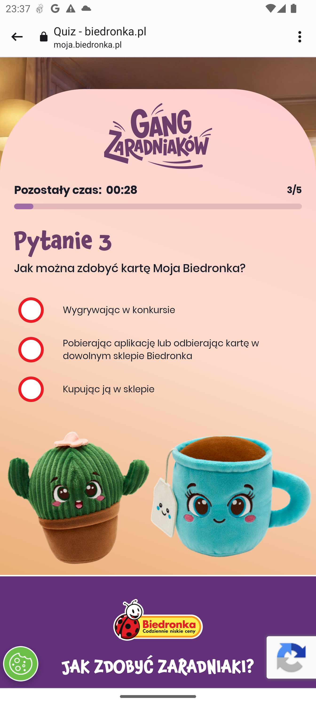

# Agent do testowania quizów Android

Prosty agent pomocniczy do testów i debugowania aplikacji Android. Łączy sterowanie telefonem przez ADB, zrzuty ekranu, OCR oraz pamięć pytań w SQLite. Na podstawie scenariusza JSON może przejść przez ekran quizu, odczytać pytanie i warianty odpowiedzi, a następnie wskazać lub nacisnąć wybraną opcję.

Projekt jest przeznaczony wyłącznie do testowania aplikacji, urządzeń i quizów, do których masz uprawnienia.

## Co zawiera projekt

- `android.py` — komunikacja z telefonem przez ADB, wykonywanie zrzutów i obsługa dotknięć;
- `quiz_solver.py` — przygotowanie obrazu, OCR w języku polskim, baza pytań SQLite i wybór odpowiedzi przez model LLM;
- `scenario_runner.py` — wykonanie kroków opisanych w JSON;
- `scenario.json` — scenariusz automatyzacji;
- `quiz.sqlite3` — lokalna pamięć wcześniej rozpoznanych pytań i odpowiedzi;
- `image/` — przykładowe zrzuty ekranu.

## Przykładowe obrazy

Obszar obrazu po przycięciu, który trafia do OCR:

<a href="image/last_ocr_crop.png"></a>

Przykładowe ekrany z pytaniami quizowymi:

<a href="image/screen_20260917_233653_757792.png"></a>
<a href="image/screen_20260917_233704_723458.png"></a>

## Wymagania

- Python 3.10 lub nowszy;
- Android SDK Platform Tools (`adb`) oraz urządzenie z włączonym **Debugowaniem USB** albo połączeniem ADB przez Wi-Fi;
- Tesseract OCR z pakietem języka polskiego (`pol`);
- klucz API OpenRouter, gdy nowa odpowiedź ma być wybierana przez LLM.

Na macOS można zainstalować narzędzia systemowe przez Homebrew:

```bash
brew install android-platform-tools tesseract tesseract-lang
```

Na Ubuntu/Debian:

```bash
sudo apt update
sudo apt install adb tesseract-ocr tesseract-ocr-pol
```

## Tworzenie środowiska `venv`

W katalogu projektu wykonaj:

```bash
python3 -m venv .venv
source .venv/bin/activate
python -m pip install --upgrade pip
pip install -r requirements.txt
```

Po aktywacji środowiska w terminalu zwykle pojawi się prefiks `(.venv)`. Aby wyjść ze środowiska, użyj:

```bash
deactivate
```

W Windows (PowerShell) aktywacja wygląda tak:

```powershell
.\.venv\Scripts\Activate.ps1
```

## Konfiguracja klucza API

Agent sprawdza najpierw lokalną bazę `quiz.sqlite3`. Jeśli pytania w niej nie ma, `quiz_solver.py` korzysta z OpenRouter. Ustaw klucz tylko w bieżącej sesji terminala:

```bash
export OPENROUTER_API_KEY='twoj-klucz-api'
```

Nie zapisuj klucza w `scenario.json`, kodzie ani repozytorium.

## Szybki start

1. Podłącz telefon przez USB i zaakceptuj debugowanie na urządzeniu, a potem sprawdź połączenie:

   ```bash
   adb devices
   ```

2. Najpierw sprawdź scenariusz bez wykonywania akcji na telefonie:

   ```bash
   python scenario_runner.py scenario.json --dry-run
   ```

3. Uruchom scenariusz na podłączonym urządzeniu. Parametr `--code` podstawia wartość za `{code}` w pliku JSON:

   ```bash
   python scenario_runner.py scenario.json --code TWOJ_KOD
   ```

Jeśli ADB nie jest dostępne w `PATH`, podaj jego ścieżkę:

```bash
python scenario_runner.py scenario.json \
  --adb-path ~/Library/Android/sdk/platform-tools/adb \
  --code TWOJ_KOD
```

## Test pojedynczego zrzutu i OCR

Do sprawdzenia rozpoznawania tekstu bez uruchamiania pełnego scenariusza użyj obrazu z katalogu `image`:

```bash
python quiz_solver.py image/screen_20260917_233653_757792.png --debug
```

Flaga `--debug` zapisuje podgląd obrazu po przetworzeniu. Gdy OCR ma problem z układem ekranu, można dopasować zakres analizowanego fragmentu przez `--crop-top-px`, `--crop-bottom-px` lub czułość grupowania opcji `--gap-multiplier`.

## Debugowanie dotknięć

Aby zapisać współrzędne dotknięć ekranu i wykorzystać je w scenariuszu:

```bash
python android.py --record-taps
```

Akcje automatyzacji są opisane w `scenario.json`. Najważniejsza akcja, `solve_and_tap`, wykonuje zrzut, odczytuje pytanie i naciska dopasowaną odpowiedź. Warto najpierw uruchomić scenariusz z `--dry-run`, a potem testować na urządzeniu testowym.
